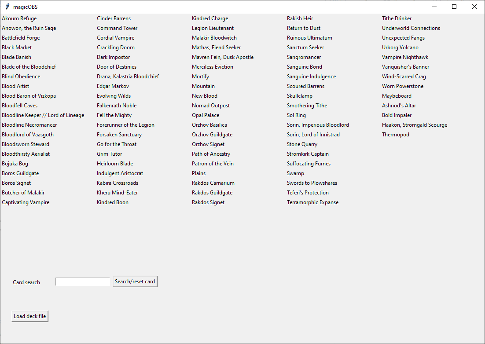
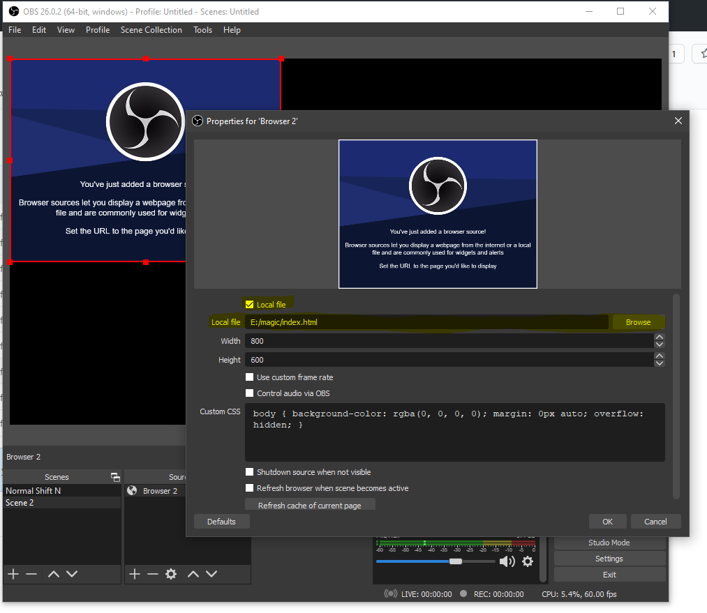
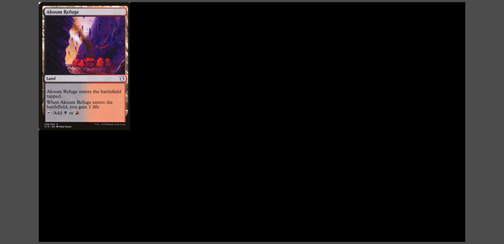

# magicOBS

Display Magic: The Gathering cards in OBS.

Load in your personal deck file from any deck building site that gives out a list in .txt format.


## Usage 

1. Download the [latest release](https://github.com/d3kker/magic/releases/latest) and unpack it. 
2. Open OBS.
3. Add a new browser source.
4. Tick the  "Local file" checkbox and add the Index.html to the browser source:

5. Start the magicOBS.exe.
6. Load in a "Decklist.txt". If you click the name of the card it shows up on the screen in OBS.  Alternatively you can use the search field to search for any card (even outside your deck).
7. Adjust the browser screen / card view in OBS. 


If you leave the search field empty, the next search will remove the last shown card. 

## How to build the executable

We use PyInstaller to build the executable. We specifically do not use Python bundled with Anaconda, as Anaconda comes with a number of packages installed that will be bundled with the executable created with PyInstaller. This will lead to a very large file size and long loading times during program execution. Instead, we use a stand-alone Python version and create a virtual environment, in which only modules actually required by magicOBS are installed.

Download Python from https://www.python.org/downloads/.

In CMD, go to the magicOBS directory and create a virtual environment. The name of the virtual environment can be anything, here we choose "venv_py39" because we use Python 3.9.

Then in CMD, enter:

```
python -m venv venv_py39
```

and then activate the environment by executing

```
venv_py39\Scripts>activate.bat
```

Install all modules required using pip:

```
pip install -r requirements.txt
```

The "-r" option is short for "--requirement" and needs to be followed by <file>. If you make modifications to magicOBS.py and add or remove modules, you can list all modules currently installed in the virtual environment by typing

```
pip freeze
```

To save the output in a requirements file, type:

```
pip freeze > requirements.txt
```

Finally, create the executable using

```
pyinstaller -w -F magicOBS.py
```

where "-F, --onefile" creates a one-file bundled executable and "-w, --windowed, --noconsole" on Windows and Mac OS X suppresses the console window for standard i/o that would otherwise appear during program execution. The executable is saved in the dist directory.

## Acknowledgements

magicOBS uses the [Scryfall API](https://scryfall.com/docs/api). We are not associated with Scryfall nor does Scryfall endorse our work in any way.